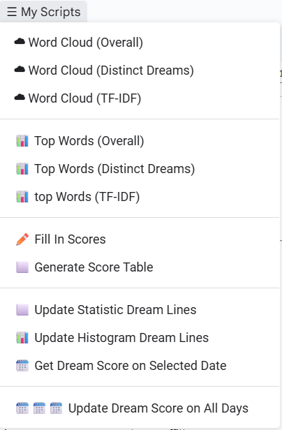
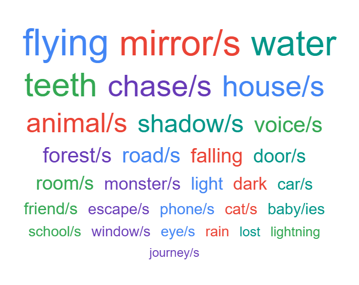

# Dream Journal

## Scripts UI menu on Google Doc

  

## Required File Structure

I will indicate with (H1) the heading 1 style in Google Docs, (H2) the heading 2; use the same labels ans styles I'm using unless specified otherwise.

- **Title:** Choose your preferred title  
  Suggested: `Dream Journal [Year]`

- **Index (H1)** This must be followed by the Table of Contents (TOC).  
  This is necessary to create links in the summary table and it will help in navigating the entries.
  
- **Frequency (H1)** This section will host **Top words** and **Word Cloud** once generated.  
  I suggest having several entries before running the frequency functions, or they won't have much data to work on.  
  The `overall` mode can be used sooner, but the other two require more entries.  
  You could leave just the title in the meantime. 
  
- **Statistics (H1)** This section must be populated with the **Average and Median (H2)** and its relative table (see below) in order to use the automatic scoring function.  
  It will also host **Dream Length Distribution (lines)**, a histogram created by estimating the number of lines per entry. You can run it after adding the table, but it won't have much data until you have several entries.

Once it's completed, the TOC will include the following sections:

## TOC

- Index (H1)  
- Uncertain Date Table (H1) *  
- Score Table (H1) *  
- Frequency (H1)  
   - Top words (H2) *  
   - Word cloud (H2) *  
- Statistics (H1)  
   - Average and median (H2) **  
   - Dream Length Distribution (lines) (H2) *

Marked with * are the sections that will auto-generate after running the scripts.  
Marked with ** is the section that can auto-generate, but it's suggested to copy the table below to start with.  
After that, you will have your dream entries and/or fragments (very short dreams):  

- Dreams DD/MM/YEAR - D:2.5 LD:0 Score:2.5 (H1)  
   - Example Title 1 (H2)  
   - Example Title 2 (H2)  
   - Fragment - Example Title 3 (H2)

Start your fragment title like in the example above; that will help make the number of lines statistics more accurate.  
It is important and necessary to give each dream a title; that will help in navigating the entries in the TOC,  
and it is the way the scripts will distinguish one dream from another.

The day can be omitted if not remembered. These kinds of dreams will end up in the "Uncertain Date Table" instead of the regular one:

- `Dreams ??/MM/YEAR - D:0.5 LD:0 Score:0.5` (H1)  
  - `Example Title 1` (H2)

---

## Template dream entry
Comments can be added in curly braces; they will be skipped by scripts even if they are in normal text.

Dreams DD/MM/YEAR - D:1 LD:0 Score:1 (H1)  
Lore Ipsum (H2)  

{Gone to sleep 23:00}  
Lorem ipsum dolor sit amet, consectetur adipiscing elit. Pellentesque euismod, nisi a vestibulum malesuada, sapien neque tincidunt lorem, sed laoreet nisi nisl at sapien. Integer ut ante nec justo porta bibendum. Sed fringilla, turpis in ullamcorper commodo, neque felis gravida magna, ac luctus nunc leo eget nunc.  
Vestibulum ante ipsum primis in faucibus orci luctus et ultrices posuere cubilia curae; Nullam efficitur, eros vel pretium fermentum, tortor orci rhoncus orci, non sollicitudin diam odio in turpis.  
Phasellus vel est sed leo vehicula tincidunt. Proin elementum, nulla ac convallis rutrum, velit lorem hendrerit tortor, eget malesuada massa lorem sed sem.  
{Woke up at 7:00}

---

## Scoring System

`[D(Dream Score): number  LD(Lucid Dream Score): number  Score(Total Score): number]`  
 
The dream is scored based on the statistics table and the entry length.  
You can run **🗓️ Get Dream Score on Selected Date** after placing your cursor on a dream date.  
The script will automatically assign a score to the dream entry and ask you to confirm updating the `D` value for the selected date.  
Fragments have a fixed score of 0.5, while if you remembered a dream but then forgot it and have nothing to write, you can manually give it a 0.25.
Normal dream can't get less than 0.5 and will get a score in icnrements of 0.5, you cna see the table below for reference.
Very long dream can get a score biggere that 2, there is no max.

The **total** `Score` is simply the sum of `D` and `LD`. You can update it with **✏️ Fill In Scores**, or anyway they will updated once the fucntion to create the **Score Table** is called.

The `LD` (Lucid Dream) score has to be inserted manually because it's hard to quantify; but you can use the following table for reference.  
Usually, I mark them using a green font color; they will also be marked with green font in the **Score Table**.

| Dream Type        | Count | Score | Lucid Dream Type       | Score |
|-------------------|-------|-------|-------------------------|-------|
| Forgotten         | 0     | 0.25  | Mention of dreams       | 0.25  |
| Fragment          | 0.5   | 0.5   | Noticed strangeness     | 0.5   |
| Dream             | 1     | 1     | Semi-lucidity           | 0.75  |
| Medium dream      | 1     | 1.5   | Full lucidity           | 1     |
| Long dream        | 1     | 2     | Lucidity with control   | 1.5   |

The count will appear in the summary `Score Table`, which you can easily copy-paste into a sheet to make more advanced data visualizations like this:

(insert image here)

---

## Most common words

### Top words

It is possible to choose 3 different kinds of analysis by using the functions **📊 Top Words(mode)**:

- Overall: this is based on the raw occurrence of words  
- Distinct Dreams: this is based on the occurrence of words in distinct dreams (if a word appears multiple times inside the same entry, it is counted only once)  
- TF-IDF (Term Frequency–Inverse Document Frequency): it measures how important a word is to a specific dream compared to the entire collection. It increases the weight of words that are frequent in one dream but rare across other dreams, helping to highlight distinctive and meaningful words.

A prompt will ask you to choose the format in which the top 30 words will be displayed:
- list  
- bar (histogram)

Here's an example of the output for the list using **📊 Top Words (Distinct Dreams)** (just 5 words, to keep the example short):

Top words distinct  
1. flying (46)  
2. mirror/mirros (41)  
3. water (39)
4. teeth (39)
5. chase/chases (38)  

To see an example of the histogram format, check below the Dream Length Distribution.

### Word Cloud

The functions **☁ Word Cloud(mode)** perform the same 3 kinds of analysis and create the same bar/list of the top 30 words, but also generate a word cloud.  
This is a rendered image of those words, with font size going from larger (more frequent) to smaller (less frequent).  
Singular/plural pairs (`mirror/mirrors`) are automatically grouped and shortened to a root form (`mirror/s`) to improve visualization.  
Here is an example generated with common dream words:  

  

---

## Score Table

The Score Table and Uncertain Date Table can be generated by running **⬜ Generate Score Table**.  
The dates in the table are also links that will jump to the correptive date in the doc.  
Remember to update the TOC or new links won't form.  
When LD Score is bigger or equal than 1 the font would be green, to help visualize when the table will be long.
A prompt will ask to skip dreams with a score less than 0.25 (forgotten or no dreams at all), and a table similar to this will be created:

| 📅 Date     | Week     | Month | # Dreams | D Score | LD Score | Total Score |
|------------|----------|--------|----------|---------|----------|--------------|
| 15/05/2025 | 2025-W20 | May    | 2        | 3.5     | 0        | 3.5          |
| 17/05/2025 | 2025-W20 | May    | 2        | 3.5     | 0        | 3.5          |
| 19/05/2025 | 2025-W21 | May    | 1.5      | 1.5     | 0        | 1.5          |
| 20/05/2025 | 2025-W21 | May    | 2        | 4.5     | 0        | 4.5          |

If scores less than 0.25 are included, the table will fill in missing days as well, so that you can copy-paste it into a sheet directly without worrying about holes in the dating system.

---

## Statistics
### Average and median

The **Average and median** table can be genrated by using **⬜ Update Statistic Dream Lines**, but i suggests to make your own after you have several entries.  
If you want to check them anyway, you can run the funtion and an alert will show them, then you can answer **No** to the successive prompt that ask to update them.
Initially you can copy-past this version under the **Statics (H1)** and **Average and median (H2)**:

| Metric                 | Value |
|------------------------|-------|
| Average                | 14,0  |
| Median                 | 11,0  |
| Standard Deviation     | 9,0   |
| Median Absolute Deviation (MAD) | 5,0   |
| Scaled MAD             | 7,5   |
| Interquartile Range (IQR) | 13,0  |
| Average + SD           | 23,0  |
| Average - SD           | 5,0   |

Once you have your own you can simply use **🗓️🗓️🗓️ Update Dream Score on All Days** to udpate all entries based on your statics. 
This operation won't ask any prompt and update directly all days. If you want to supervise the operation, you need to use **🗓️ Get Dream Score on Selected Date** date by date as explained above.

### Dream Length Distribution

The histrogram is upgraded when the statics are calulated using **'⬜ Update Statistic Dream Lines'**,  
but you can update or generate it without triggerening a statitstics udpate by using **'📊 Update Histogram Dream Lines'**  
The full histrogram will show value from 1 line dream until 49 lines, 50 or more lines dreams will end in the bucket 50+.  
Here a sample with only values from 10 lines to 30:
 
...  
10  | ███████████████████████ (6) 
11  | ███████████████ (4) 
12  | ███████████ (3) 
13  | ███████████████████ (5) 
14  | ███████████ (3) 
15  | ████████ (2) 
16  | ████ (1) 
17  | ███████████ (3) 
18  | ███████████████ (4) 
19  | ███████████████ (4) 
20  | ███████████████████ (5) 
21  | ████ (1) 
22  | ███████████ (3) 
23  |  
24  | ███████████████ (4) 
25  | ████████ (2) 
26  |  
27  | ████ (1) 
28  | ████ (1) 
29  |  
30  | ███████████████ (4) 
...  

